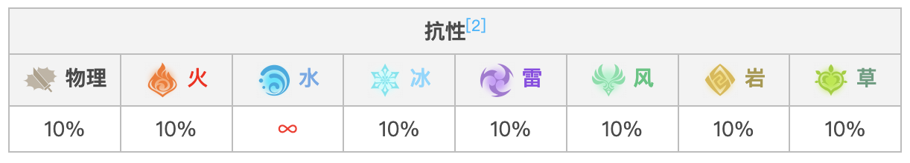
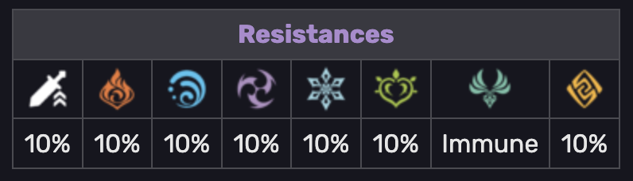

==========
Enemy Info
==========

Enemy Resistance
================

Characters and enemies can have different resistances to `elemental <https://genshin-impact.fandom.com/wiki/Elemental>`_
and physical damage. There are further ways to increase or decrease these resistances. The resistance attribute is
denoted by RES in-game. Its formula is:

.. note::
    This module deals with RES Base only

Here is an example of the Base resistance of
`Large Anemo Slime <https://genshin-impact.fandom.com/wiki/Large_Anemo_Slime>`_:

.. automodule:: peitho_data.genshin_impact.enemy.resistance
   :members:
   :undoc-members:
   :show-inheritance:

Internals
=========

.. toctree::
   :caption: Enemy Info Internals
   :hidden:

   enemy_internal

:doc:`enemy_internal`
    Get to know how enemy info module works internally
